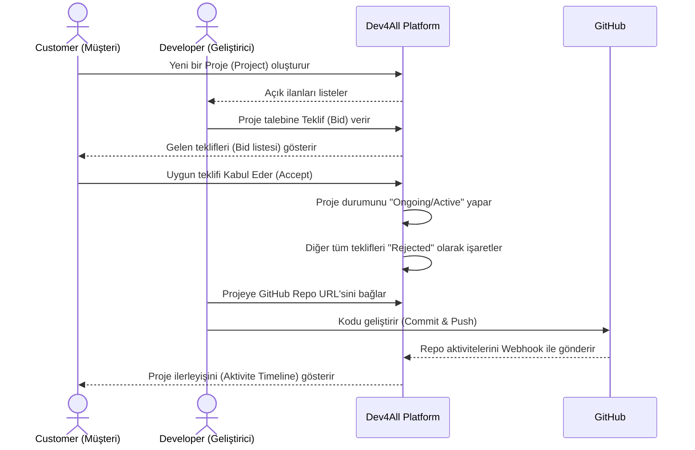

# 02. Functional Requirements Document (FRD) - Dev4All

## 1. Giriş ve Amaç

Bu doküman, **Dev4All** platformunun işlevsel gereksinimlerini, kullanıcı rollerine göre kullanım senaryolarını (Use Cases), kullanıcı hikayelerini (User Stories), iş kurallarını (Business Rules) ve sistem akışlarını eksiksiz biçimde tanımlar.

FRD, BRD'de (Business Requirements Document) ortaya konan iş hedeflerini yazılım gereksinimlerine dönüştüren referans dokümanıdır. Geliştirme sürecinde her özelliğin hangi iş kuralına dayandığını bu doküman üzerinden izlemek mümkündür.

---

## 2. Kullanıcı Rolleri (Actors)

| Rol | Tanım |
|-----|-------|
| **Customer (Müşteri)** | Yazılım projesi geliştirmek isteyen bireysel veya kurumsal kullanıcı. Proje ilanı açar, teklif değerlendirir, projeyi takip eder. |
| **Developer (Geliştirici)** | Freelance veya küçük takım geliştiricisi. Proje ilanlarını inceler, teklif (Bid) verir ve projeye atandığında geliştirmeyi gerçekleştirir. |
| **Administrator (Sistem Yöneticisi)** | Platformdaki kullanıcı, ilan ve sistem parametrelerini denetleyen yetkili rol. Sadece yetkili teknik personel tarafından kullanılır. |

---

## 3. Sistem Akış Diyagramı

Aşağıdaki diyagramda platformun uçtan uca yaşam döngüsü gösterilmektedir:



---

## 4. Kullanıcı Hikayeleri (User Stories)

### 4.1. Customer (Müşteri) Hikayeleri

| ID | Kullanıcı Hikayesi |
|----|-------------------|
| `US-C01` | Bir müşteri olarak platforma **kayıt olabilmeli** (e-posta + şifre ile) ve ardından **giriş yapabilmeliyim**. Hesabıma ait bir profil sayfasına erişebilmeliyim. |
| `US-C02` | Yeni bir **Proje İlanı (Project)** açabilmeliyim; başlık, açıklama, bütçe, teslim tarihi (deadline), teklif bitiş tarihi (BidEndDate) ve beklenen teknoloji yığınını belirtebilmeliyim. |
| `US-C03` | Oluşturduğum ilanı **güncelleyebilmeli** (başlık, açıklama, bütçe vb.) veya yayından kaldırabilmeliyim; ancak teklife açık bir ilana teklif geldikten sonra bütçeyi düşürememek gibi kısıtlamalar uygulanmalıdır. |
| `US-C04` | Açtığım ilana gelen tüm teklifleri (Bid) **fiyat ve süre bazında listeleyebilmeli**, Developer profil bilgilerini (ad, öneri notu) inceleyebilmeliyim. |
| `US-C05` | Uygun gördüğüm teklifi **"Kabul Et (Accept)"** butonuyla onaylayabilmeliyim. Kabul işlemi sonrası proje otomatik olarak "Aktif/Ongoing" durumuna geçmelidir. |
| `US-C06` | Proje başladıktan sonra detay sayfasında bağlı GitHub reposunun **commit ve aktivite geçmişini (Aktivite Timeline)** görüntüleyebilmeliyim; kodlama bilgisi gerektirmeden proje ilerleyişini takip edebileyim. |
| `US-C07` | Platformun bana gönderdiği **e-posta bildirimlerini** alabilmeliyim: yeni teklif geldiğinde ve proje önemli bir aşamaya ulaştığında. |

### 4.2. Developer (Geliştirici) Hikayeleri

| ID | Kullanıcı Hikayesi |
|----|-------------------|
| `US-D01` | Bir geliştirici olarak platforma **Developer rolüyle kayıt olabilmeli** ve profil bilgilerimi (isim, uzmanlık alanı vb.) güncelleyebilmeliyim. |
| `US-D02` | Platformdaki tüm **açık (Open)** durumdaki proje ilanlarını listeleyebilmeli; başlık, bütçe, teknoloji ve kalan teklif süresi gibi bilgileri görebilmeliyim. |
| `US-D03` | İlgilendiğim bir proje ilanına, kendi **teklif tutarımı (BidAmount)** ve **öneri notumu (ProposalNote)** girerek Teklif (Bid) verebilmeliyim. |
| `US-D04` | Daha önce verdiğim bir teklifi **güncelleyebilmeliyim**; ancak aynı ilana ikinci bir teklif açamam. |
| `US-D05` | Teklifim müşteri tarafından **kabul edildiğinde** projenin "Aktif" durumuna geçtiğini görmeli ve projenin bana atandığını `AssignedDeveloperId` üzerinden teyit edebilmeliyim. |
| `US-D06` | Aktif projeye **GitHub Repo URL'sini** (ve isteğe bağlı Branch bilgisini) ekleyebilmeliyim; sistem bu repoyu takibe almalıdır. |
| `US-D07` | Teklifimin **kabul veya reddedildiğine dair e-posta bildirimi** alabilmeliyim. |

### 4.3. Administrator (Sistem Yöneticisi) Hikayeleri

| ID | Kullanıcı Hikayesi |
|----|-------------------|
| `US-A01` | Sistem yöneticisi olarak tüm kullanıcı listesini görüntüleyebilmeli, kullanıcı rollerini değiştirebilmeli ve hesapları askıya alabilmeliyim. |
| `US-A02` | Platformdaki tüm proje ilanlarını ve teklifleri denetleyebilmeli, kurallara aykırı içerikleri kaldırabilmeliyim. |
| `US-A03` | Sistem genelinde kritik hata loglarını ve e-posta gönderim durumlarını izleyebilmeliyim. |

---

## 5. Fonksiyonel Özellik Modülleri

### 5.1. Kimlik Doğrulama ve Yetkilendirme (Authentication & Authorization)

| ID | Gereksinim |
|----|-----------|
| `FR-AUTH-01` | Sistem, kullanıcı kaydı sırasında **e-posta ve şifre** ile hesap oluşturulmasına izin verir. |
| `FR-AUTH-02` | Kullanıcı rolü kayıt sırasında seçilir: `Customer` veya `Developer`. Rol sonradan yalnızca Admin tarafından değiştirilebilir. |
| `FR-AUTH-03` | Başarılı giriş sonrasında sistem bir **JWT (JSON Web Token)** döner. Token, kullanıcının `Id`, `Role` ve `Email` bilgilerini içerir. |
| `FR-AUTH-04` | JWT token süresi **60 dakika** olarak ayarlanır. Süre dolduğunda kullanıcı yeniden giriş yapar veya Refresh Token mekanizması devreye girer. |
| `FR-AUTH-05` | Tüm API uçları (public listeler hariç) `[Authorize]` attribute'u ile korunur. Rol bazlı kısıtlamalar `[Authorize(Roles = "Customer")]` şeklinde uygulanır. |
| `FR-AUTH-06` | Şifreler veritabanında **bcrypt (Hash + Salt)** algoritması ile saklanır; düz metin olarak hiçbir zaman yazılmaz. |
| `FR-AUTH-07` | Kayıt sonrasında kullanıcıya **e-posta doğrulama** bağlantısı gönderilir. E-posta doğrulanmadan teklif verme veya ilan açma işlemleri engellenebilir (MVP sonrası). |

---

### 5.2. Proje Yönetimi (Project Management)

| ID | Gereksinim |
|----|-----------|
| `FR-PR-01` | **Yalnızca `Customer` rolündeki** kullanıcılar proje (Project) oluşturabilir. |
| `FR-PR-02` | Proje talebi oluştururken aşağıdaki alanlar zorunludur: `Title` (3–100 karakter), `Description` (10–2000 karakter), `Budget` (pozitif ondalık sayı), `Deadline` (gelecek tarih), `BidEndDate` (Deadline'dan önce, gelecek tarih). |
| `FR-PR-03` | Opsiyonel alan: `Technologies` (etiket listesi, örn. "React, .NET, PostgreSQL"). |
| `FR-PR-04` | Oluşturulan proje varsayılan olarak **`Open` (Açık)** statüsüyle kaydedilir. |
| `FR-PR-05` | `Customer` kendi ilanını **düzenleyebilir**; ancak ilana en az bir teklif geldikten sonra `Budget` yalnızca **artırılabilir**, azaltılamaz. |
| `FR-PR-06` | `Customer` kendi ilanını **silebilir (soft delete)**; ancak `Ongoing` veya `Completed` durumdaki projeler silinemez. |
| `FR-PR-07` | **Tüm kullanıcılar** (giriş yapmış Developer ve Customer) `Open` durumdaki ilanları listeleyebilir; sayfalama (pagination) ile sunulur. |
| `FR-PR-08` | **Yalnızca ilan sahibi Customer**, kendi ilanına gelen tüm teklifleri (Bid listesi) görebilir. |
| `FR-PR-09` | `BidEndDate` geçen ve hâlâ `Open` olan ilanlar **Quartz.NET arka plan servisi** tarafından otomatik olarak **`Expired` (Süresi Dolmuş)** statüsüne alınır. |

**Project Durum Makinesi:**

```
Open ──(BidEndDate geçerse)──────────────────► Expired
Open ──(Teklif Kabul edilirse)───────────────► AwaitingContract
AwaitingContract ──(İki Taraf Onayı)─────────► Ongoing
AwaitingContract ──(Bir Taraf İptal ederse)──► Cancelled
Ongoing ──(Proje tamamlanırsa)───────────────► Completed
```

---

### 5.3. Teklif Sistemi (Bid Management)

| ID | Gereksinim |
|----|-----------|
| `FR-BID-01` | **Yalnızca `Developer` rolündeki** kullanıcılar teklif (Bid) verebilir. |
| `FR-BID-02` | Bir Developer, aynı proje ilanına yalnızca **tek bir aktif teklif** verebilir. İkinci bir teklif açılmaya çalışıldığında hata döndürülür. |
| `FR-BID-03` | Teklif verme işleminde aşağıdaki alanlar zorunludur: `BidAmount` (pozitif ondalık, > 0), `ProposalNote` (10–1000 karakter). |
| `FR-BID-04` | Developer, verdiği teklifin `BidAmount` ve `ProposalNote` alanlarını ilanın durumu `Open` olduğu süre içinde **güncelleyebilir**. |
| `FR-BID-05` | `BidEndDate` geçmiş veya `Ongoing`/`Expired` durumdaki ilanlar için yeni teklif **verilemez** ve mevcut teklifler **güncellenemez**. |
| `FR-BID-06` | Müşteri bir teklifi kabul ettiğinde (`AcceptBidCommand`): ilanın durumu **`AwaitingContract`** olur, kabul edilen teklifin `IsAccepted = true` olarak işaretlenir, ilandaki diğer tüm teklifler otomatik olarak `Rejected` statüsüne alınır. Sistem otomatik olarak sözleşme taslağını (`Contract`) oluşturur. |
| `FR-BID-07` | Developer, kendi verdiği teklifin durumunu (Pending / Accepted / Rejected) görebilir. |
| `FR-BID-08` | Teklif veren Developer sayısı (`BidCount`) proje ilanı detay ekranında toplam bilgi olarak gösterilir. |

**Bid Durum Makinesi:**

```
Pending ──(Müşteri kabul ederse)──► Accepted
Pending ──(Başka teklif kabul edilirse)──► Rejected
Pending ──(Developer geri çekerse)──► Withdrawn (Opsiyonel, MVP sonrası)
```

---

### 5.4. Proje Yönetimi (Project Lifecycle)

| ID | Gereksinim |
|----|-----------|
| `FR-PROJ-01` | Bir teklif kabul edildiğinde, sistem otomatik olarak `Project` üzerindeki `AssignedDeveloperId` alanını güncellerke ve `Status` değerini `AwaitingContract` olarak ayarlar. |
| `FR-PROJ-02` | `Ongoing` durumdaki proje, ilan sahibi Customer ve atanan Developer tarafından detay ekranıyla görüntülenebilir. |
| `FR-PROJ-03` | Atanan Developer, proje detay sayfasından ilgili **GitHub Repository URL'sini ve Branch bilgisini** ekleyebilir. |
| `FR-PROJ-04` | Customer kendi projelerini, Developer ise atandığı projeleri ilgili dashboard ekranlarında listeleyebilir. |
| `FR-PROJ-05` | Proje tamamlandığında `Status` değeri `Completed` olarak güncellenir. Bu işlem geçici olarak yalnızca Developer veya Admin tarafından yapılabilir (MVP). |

---

### 5.4b. Sözleşme Yönetimi (Contract Management)

| ID | Gereksinim |
|----|-----------|
| `FR-CONTRACT-01` | Teklif kabul edildiği anda sistem, proje başlık/açıklama/bütçe/deadline bilgilerini kullanarak **otomatik bir sözleşme taslağı** (`Contract`) oluşturur. |
| `FR-CONTRACT-02` | Sözleşme varsayılan olarak `Draft` statüsünde oluşturulur; her iki tarafın onayı beklenmektedir. |
| `FR-CONTRACT-03` | Customer veya Developer sözleşme metnini **revize edebilir**. Bir taraf revize ettiğinde: `RevisionNumber` artar, revizyon öncesi metin `ContractRevision` tablosuna snapshot olarak kaydedilir, diğer tarafın onay durumu sıfırlanır (`IsCustomerApproved` veya `IsDeveloperApproved` → `false`), diğer tarafa e-posta bildirimi gönderilir. |
| `FR-CONTRACT-04` | Her iki taraf onayladığında (`IsCustomerApproved = true` **ve** `IsDeveloperApproved = true`): `Contract.Status` → `BothApproved`, `Project.Status` → `Ongoing`. |
| `FR-CONTRACT-05` | Taraflardan biri sözleşmeyi **iptal ettiğinde**: `Contract.Status` → `Cancelled`, `Project.Status` → `Cancelled`. Her iki tarafa bildirim gönderilir. |
| `FR-CONTRACT-06` | Yalnızca projeye ait Customer ve Developer sözleşmeyi görüntüleyebilir, düzenleyebilir veya onaylayabilir. Admin her sözleşmeyi görüntüleyebilir. |
| `FR-CONTRACT-07` | Sözleşme revizyon geçmişi (`ContractRevision`) korunur; kim, ne zaman, ne numaralı revizyon yaptığı izlenebilir. |

---

### 5.5. GitHub Entegrasyonu

| ID | Gereksinim |
|----|-----------|
| `FR-GH-01` | Proje `Ongoing` durumuna geçtikten sonra Developer, proje ayarlarından **GitHub Repository URL** ve opsiyonel olarak **Branch** bilgisini sisteme ekler. |
| `FR-GH-02` | Sistem, eklenen repo bilgisini `GitHubLog` tablosuna ilk kayıt olarak yazar ve ilgili projeyle ilişkilendirir. |
| `FR-GH-03` | GitHub tarafında Developer, projesinin "Settings > Webhooks" bölümüne Dev4All'ın webhook endpoint adresini (`POST /api/webhooks/github`) ve `Secret Key` bilgisini ekler. |
| `FR-GH-04` | Developer her `git push` yaptığında GitHub Webhook, API'ye bir `PushEvent` payload'ı iletir. API, bu payload'dan `CommitHash`, `CommitMessage`, `AuthorName`, `PushedAt` bilgilerini ayrıştırır ve `GitHubLog` tablosuna kaydeder. |
| `FR-GH-05` | Webhook payload'ının gerçekten bu projeye ait GitHub'dan geldiği doğrulanır; `HMAC-SHA256` imzası ile `Secret Key` eşleşmesi kontrol edilir. İmzasız veya hatalı payload'lar `401 Unauthorized` ile reddedilir. |
| `FR-GH-06` | Customer, proje detay sayfasında **Aktivite Timeline** bileşeni aracılığıyla tüm commit geçmişini (commit mesajı, geliştirici adı, zaman) kronolojik olarak görüntüler. |
| `FR-GH-07` | GitHub API rate limit aşımı durumunda sistem loglama yapar ve son başarılı çekimden itibaren delta güncellemesini tamamlar. |

---

### 5.6. E-Posta Bildirimleri (Email Notifications)

| ID | Gereksinim | Tetikleyici |
|----|-----------|-------------|
| `FR-MAIL-01` | Hoş geldin & e-posta doğrulama maili | Kayıt sonrası |
| `FR-MAIL-02` | Customer'a yeni teklif bildirimi | Developer yeni Bid eklediğinde |
| `FR-MAIL-03` | Developer'a teklif kabul bildirimi & sözleşme taslağı hazır | Customer "Accept" ettiğinde |
| `FR-MAIL-04` | Developer'a teklif red bildirimi | Başka bir teklif kabul edildiğinde |
| `FR-MAIL-05` | Customer'a proje başladı bildirimi | Developer GitHub repo bağladığında |
| `FR-MAIL-06` | Karşı tarafa sözleşme revize edildi bildirimi | Taraflardan biri sözleşmeyi düzenlediğinde |
| `FR-MAIL-07` | Her iki tarafa sözleşme onaylandı & proje başladı bildirimi | İki taraf da sözleşmeyi onayladığında |
| `FR-MAIL-08` | Her iki tarafa sözleşme iptal edildi bildirimi | Taraflardan biri sözleşmeyi iptal ettiğinde |

> Tüm e-posta gönderimleri, **Quartz.NET** tabanlı bir arka plan kuyruğu (Background Job Queue) üzerinden asenkron olarak işlenir; API yanıt süresi etkilenmez.

---

## 6. Kullanım Senaryoları (Use Cases) ve İş Kuralları

### UC-01 — Proje İlanı Oluşturma

**Aktör:** Customer  
**Ön Koşul:** Kullanıcı giriş yapmış ve Customer rolüne sahip.  
**Ana Akış:**
1. Customer "Yeni İlan Oluştur" formunu açar.
2. Zorunlu alanları (Başlık, Açıklama, Bütçe, Deadline, BidEndDate) doldurur.
3. "Oluştur" butonuna tıklar.
4. Sistem, `FluentValidation` ile alanları doğrular.
5. Doğrulama başarılıysa kayıt `Open` statüsüyle veritabanına yazılır.
6. Customer ilan detay sayfasına yönlendirilir.

**Alternatif Akış (Hata):** Zorunlu alan eksik veya format hatalıysa 400 Bad Request dönülür, form hataları kullanıcıya gösterilir.

---

### UC-02 — Teklif Verme

**Aktör:** Developer  
**Ön Koşul:** Kullanıcı giriş yapmış, Developer rolüne sahip, ilanın durumu `Open` ve `BidEndDate` geçmemiş.  
**Ana Akış:**
1. Developer ilan listesinden bir ilan seçer, detayları inceler.
2. "Teklif Ver" formunu açar, tutar ve öneri notunu girer.
3. Sistem aynı Developer'ın aynı ilana daha önce teklif verip vermediğini kontrol eder.
4. İlk teklif ise `Pending` statüsüyle kaydedilir.
5. Customer'a bildirim e-postası kuyruğa eklenir.

**İş Kuralı (UC-02-BR01):** Bir Developer, aynı ilana yalnızca bir aktif teklif verebilir. Tekrarda `409 Conflict` döner.

---

### UC-03 — Teklif Kabul Etme

**Aktör:** Customer  
**Ön Koşul:** Customer giriş yapmış, ilanın durumu `Open`.  
**Ana Akış:**
1. Customer kendi ilanına ait teklif listesini açar.
2. Bir teklifi seçerek "Kabul Et" butonuna tıklar.
3. Sistem bir transaction içinde:
   - `ProjectRequest.Status` → **`AwaitingContract`**
   - Seçilen `Bid.IsAccepted` → `true`, `Bid.Status` → `Accepted`
   - Diğer tüm `Bid`'ler → `Status = Rejected`
   - `ProjectRequest.AssignedDeveloperId` → kabul edilen Developer'ın Id'si
   - Sistem otomatik `Contract` taslağı oluşturur (`Status = Draft`)
4. Kabul edilen Developer'a e-posta bildirimi + "Sözleşme taslağı hazır" bildirimi gönderilir.
5. Reddedilen Developer'lara toplu bildirim kuyruğa eklenir.

**İş Kuralı (UC-03-BR01):** Bir proje için yalnızca bir teklif kabul edilebilir. İkinci bir kabul işlemi engellenmelidir.

---

### UC-03b — Sözleşme Revizyonu

**Aktör:** Customer veya Developer  
**Ön Koşul:** `Contract.Status = Draft` veya `UnderReview`, kullanıcı projenin tarafı.  
**Ana Akış:**
1. Taraf sözleşme metnini düzenleyerek "Kaydet" butonuna tıklar.
2. Sistem bir transaction içinde:
   - Mevcut `Contract.Content` snapshot'ı `ContractRevision` tablosuna kaydeder.
   - `Contract.Content` → yeni metin, `Contract.RevisionNumber` artar.
   - `Contract.LastRevisedById` → düzenleyen kullanıcı Id'si.
   - Düzenleyen **Customer** ise: `Contract.IsDeveloperApproved` → `false`.
   - Düzenleyen **Developer** ise: `Contract.IsCustomerApproved` → `false`.
   - `Contract.Status` → `UnderReview`.
3. Diğer tarafa e-posta bildirimi gönderilir.

**İş Kuralı (UC-03b-BR01):** İptal edilmiş veya her iki tarafça onaylanmış sözleşme düzenlenemez.

---

### UC-03c — Sözleşme Onaylama

**Aktör:** Customer veya Developer  
**Ön Koşul:** `Contract.Status = Draft` veya `UnderReview`, kullanıcı projenin tarafı, sözleşme içeriğini inceledi.  
**Ana Akış:**
1. Taraf "Onayla" butonuna tıklar.
2. Sistem ilgili onay bayrağını `true` yapar (`IsCustomerApproved` veya `IsDeveloperApproved`).
3. Her iki bayrak da `true` ise:
   - `Contract.Status` → `BothApproved`.
   - `Project.Status` → `Ongoing`.
   - Her iki tarafa "Proje Başladı" e-postası gönderilir.
4. Yalnızca bir bayrak `true` ise sözleşme `UnderReview` durumunda bekler.

---

### UC-03d — Sözleşme İptali

**Aktör:** Customer veya Developer  
**Ön Koşul:** `Contract.Status = Draft` veya `UnderReview`.  
**Ana Akış:**
1. Taraf "İptal Et" butonuna tıklar.
2. Sistem bir transaction içinde:
   - `Contract.Status` → `Cancelled`.
   - `Project.Status` → `Cancelled`.
3. Her iki tarafa "Sözleşme İptal Edildi" e-postası gönderilir.

**İş Kuralı (UC-03d-BR01):** `Cancelled` duruma geçen proje tekrar `Open` veya başka bir duruma alınamaz.

---

### UC-04 — İlan Süresi Dolması (Scheduled Job)

**Aktör:** Sistem (Quartz.NET)  
**Tetikleyici:** Her X dakikada bir çalışan zamanlayıcı.  
**Ana Akış:**
1. Sistem `BidEndDate < DateTime.UtcNow` ve `Status = Open` olan ilanları sorgular.
2. Bu ilanların statüsünü `Expired` olarak günceller.
3. İlgili açık `Bid`'leri `Expired` olarak işaretler (veya mevcut durumda bırakır).

---

### UC-05 — GitHub Repo Bağlama

**Aktör:** Developer  
**Ön Koşul:** Proje `Ongoing` durumunda, kullanıcı projede `AssignedDeveloper` olarak atanmış.  
**Ana Akış:**
1. Developer, proje detay sayfasındaki "Repo Bağla" formunu açar.
2. GitHub Repository URL'sini (ve opsiyonel Branch) girer.
3. Sistem URL formatını doğrular (GitHub domain kontrolü).
4. Repo bilgisi kaydedilir, Customer'a bildirim gönderilir.
5. Developer, GitHub reposunda Webhook ayarını yapılandırır.

---

### UC-06 — GitHub Aktivite Takibi (Webhook)

**Aktör:** GitHub (Otomatik)  
**Tetikleyici:** Developer `git push` yapar.  
**Ana Akış:**
1. GitHub, `POST /api/webhooks/github` endpoint'ine `PushEvent` payload'ı gönderir.
2. API, `HMAC-SHA256` imzasını doğrular.
3. Payload'daki her commit için `GitHubLog` kaydı oluşturulur.
4. Customer, proje detay sayfasını ziyaret ettiğinde güncel aktivite timeline'ını görür.

---

## 7. Yetki Matrisi (Authorization Matrix)

| Özellik | Customer | Developer | Admin |
|---------|----------|-----------|-------|
| Kayıt / Giriş | ✅ | ✅ | ✅ |
| Proje İlanı Oluşturma | ✅ | ❌ | ✅ |
| Proje İlanı Düzenleme (Kendi) | ✅ | ❌ | ✅ |
| Proje İlanı Silme (Kendi) | ✅ | ❌ | ✅ |
| Açık İlanları Listeleme | ✅ | ✅ | ✅ |
| Teklif Verme | ❌ | ✅ | ❌ |
| Teklif Güncelleme (Kendi) | ❌ | ✅ | ❌ |
| İlan Tekliflerini Görme | ✅ (Kendi ilanı) | ✅ (Kendi teklifi) | ✅ |
| Teklif Kabul Etme | ✅ (Kendi ilanı) | ❌ | ✅ |
| **Sözleşme Görüntüleme** | ✅ (Kendi projesi) | ✅ (Atandığı proje) | ✅ |
| **Sözleşme Düzenleme** | ✅ (Kendi projesi) | ✅ (Atandığı proje) | ❌ |
| **Sözleşme Onaylama** | ✅ (Kendi projesi) | ✅ (Atandığı proje) | ❌ |
| **Sözleşme İptal Etme** | ✅ (Kendi projesi) | ✅ (Atandığı proje) | ✅ |
| GitHub Repo Bağlama | ❌ | ✅ (Atandığı proje) | ✅ |
| Aktivite Timeline Görme | ✅ (Kendi projesi) | ✅ (Atandığı proje) | ✅ |
| Kullanıcı Yönetimi | ❌ | ❌ | ✅ |
| Sistem Logları | ❌ | ❌ | ✅ |

---

## 8. Veri Doğrulama Kuralları (Validation Rules)

### 8.1. Kullanıcı Kaydı
| Alan | Kural |
|------|-------|
| `Email` | Geçerli e-posta formatı, benzersiz olmalı |
| `Password` | Minimum 8 karakter, en az 1 büyük harf, 1 rakam |
| `Name` | 2–100 karakter, boş olamaz |
| `Role` | `Customer` veya `Developer` değerlerinden biri |

### 8.2. Proje (Project)
| Alan | Kural |
|------|-------|
| `Title` | 3–100 karakter, boş olamaz |
| `Description` | 10–2000 karakter, boş olamaz |
| `Budget` | Pozitif ondalık sayı, > 0 |
| `Deadline` | `DateTime.UtcNow`'dan büyük olmalı |
| `BidEndDate` | `DateTime.UtcNow`'dan büyük, `Deadline`'dan önce olmalı |

### 8.3. Teklif (Bid)
| Alan | Kural |
|------|-------|
| `BidAmount` | Pozitif ondalık sayı, > 0 |
| `ProposalNote` | 10–1000 karakter, boş olamaz |

### 8.4. GitHub Repo
| Alan | Kural |
|------|-------|
| `RepoUrl` | Geçerli URL formatı, `github.com` domain'i içermeli |

### 8.5. Sözleşme (Contract)
| Alan | Kural |
|------|-------|
| `Content` | Boş olamaz, en az 50 karakter |
| `RevisionNote` | Opsiyonel, maksimum 500 karakter |

---

## 9. API Endpoint Özeti

| HTTP Metot | Endpoint | Açıklama | Yetki |
|-----------|----------|----------|-------|
| `POST` | `/api/auth/register` | Kullanıcı kaydı | Public |
| `POST` | `/api/auth/login` | Kullanıcı girişi, JWT döner | Public |
| `GET` | `/api/users/me` | Giriş yapan kullanıcının profili | Auth |
| `GET` | `/api/projects` | Açık projeleri listele (sayfalı) | Auth |
| `POST` | `/api/projects` | Yeni proje oluştur | Customer |
| `GET` | `/api/projects/{id}` | Proje detayı | Auth |
| `PUT` | `/api/projects/{id}` | Proje güncelle | Customer (Sahip) |
| `DELETE` | `/api/projects/{id}` | Proje sil (soft delete) | Customer (Sahip) |
| `GET` | `/api/projects/{id}/bids` | Projeye ait teklifleri listele | Customer (Sahip) |
| `POST` | `/api/projects/{id}/bids` | Teklif ver | Developer |
| `PUT` | `/api/bids/{id}` | Teklif güncelle | Developer (Sahip) |
| `POST` | `/api/bids/{id}/accept` | Teklif kabul et | Customer (İlan Sahibi) |
| `GET` | `/api/contracts/{projectId}` | Sözleşmeyi görüntüle | Auth (Proje Tarafı) |
| `PUT` | `/api/contracts/{projectId}` | Sözleşmeyi revize et | Customer/Developer (Proje Tarafı) |
| `POST` | `/api/contracts/{projectId}/approve` | Sözleşmeyi onayla | Customer/Developer (Proje Tarafı) |
| `POST` | `/api/contracts/{projectId}/cancel` | Sözleşmeyi iptal et | Customer/Developer (Proje Tarafı) |
| `GET` | `/api/contracts/{projectId}/revisions` | Revizyon geçmişi | Auth (Proje Tarafı) |
| `GET` | `/api/projects/{id}` | Aktif proje detayı | Auth (Proje Tarafı) |
| `PUT` | `/api/projects/{id}/repo` | GitHub repo bağla | Developer (Atanmış) |
| `GET` | `/api/projects/{id}/github-logs` | Aktivite timeline | Auth (Proje Tarafı) |
| `POST` | `/api/webhooks/github` | GitHub Webhook alıcısı | GitHub (HMAC) |

---

## 10. Kapsam Dışı Özellikler (Out of Scope — MVP)

Aşağıdaki özellikler MVP kapsamında **geliştirilmeyecektir**:

| Özellik | Açıklama |
|---------|----------|
| **Escrow / Ödeme Sistemi** | Ödemenin emanette tutulup proje tamamlanınca geliştiriciye aktarılması regülasyon gerektirmektedir. |
| **Canlı Mesajlaşma (Chat)** | Platform içi anlık mesajlaşma ilk fazda yer almaz; iletişim yalnızca teklif notları ve e-posta bildirimleriyle sağlanır. |
| **Profil Derecelendirmesi / Yorum** | Customer ve Developer arası karşılıklı değerlendirme sistemi ilerleyen versiyonlara bırakılmıştır. |
| **Mobil Uygulama** | MVP yalnızca web (React) taraflıdır; native mobil uygulama planlarda değildir. |
| **OAuth (Google, GitHub Login)** | İlk fazda yalnızca e-posta + şifre ile kimlik doğrulama desteklenir. |

---

## 11. Sözlük (Glossary)

| Terim | Açıklama |
|-------|----------|
| **Project** | Müşterinin sisteme açtığı yazılım proje ilanı. |
| **Bid** | Developer'ın bir proje ilanına verdiği fiyat ve süre teklifi. |
| **BidEndDate** | İlanın teklif almaya kapandığı tarih. |
| **Deadline** | Projenin müşteri tarafından belirlenmiş teslim tarihi. |
| **AssignedDeveloperId** | Teklifi kabul edilen Developer'ın sisteme kaydedilen benzersiz kimliği. |
| **Contract** | Teklif kabul edildiğinde sistem tarafından otomatik oluşturulan, iki tarafın müzakere edip onayladığı dijital sözleşme. |
| **ContractRevision** | Her sözleşme düzenlemesinin metin snapshot'ı ve meta verisi. |
| **AwaitingContract** | Teklif kabul edilmiş ancak sözleşme henüz iki tarafça onaylanmamış proje durumu. |
| **GitHubLog** | GitHub Webhook aracılığıyla sisteme aktarılan commit ve push aktivite kaydı. |
| **Ongoing** | Her iki tarafın sözleşmeyi onaylamasıyla geliştirme sürecine giren proje durumu. |
| **CQRS** | Command Query Responsibility Segregation — yazma ve okuma işlemlerinin ayrılması deseni. |
| **JWT** | JSON Web Token — kimlik doğrulama ve yetkilendirme için kullanılan token standardı. |
| **Webhook** | GitHub'ın belirli olaylar gerçekleştiğinde (push, merge vb.) dış bir URL'ye otomatik olarak HTTP isteği göndermesi mekanizması. |
