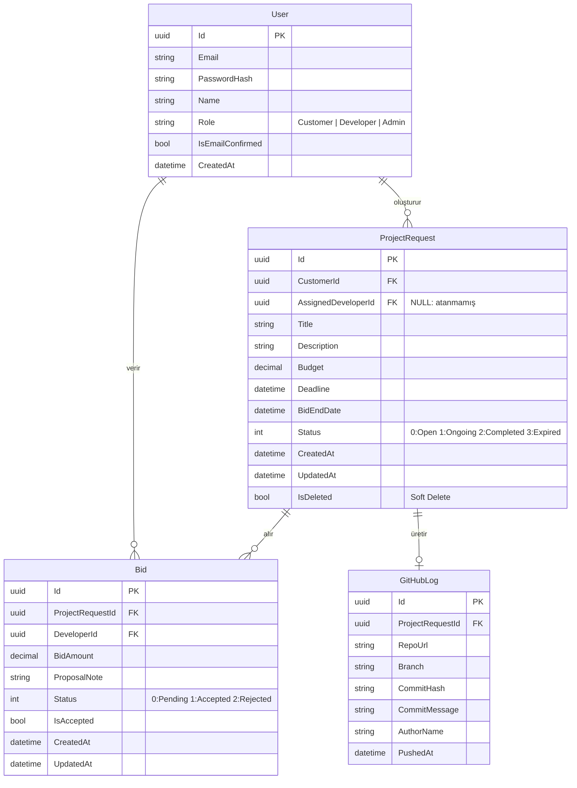

# 04. Sistem Mimarisi ve Veri Modeli (SADM) - Dev4All

## 1. Giriş ve Amaç

Bu doküman, Dev4All platformunun **backend mimari tasarımını**, **katman yapısını**, **entity ilişki modelini (ER)** ve **CQRS deseninin uygulanış biçimini** tanımlar. Geliştirme sürecinde alınan tüm mimari kararlar bu dokümana dayanır.

> Mimari değişiklikler bu dokümanı güncellemeyi gerektirir. Katman sınırlarını ihlal eden pull request'ler kabul edilmez.

---

## 2. Mimari Genel Bakış

Dev4All backend'i **Onion Architecture (Soğan Mimarisi / Hexagonal Architecture)** prensipleriyle inşa edilir. Bu yaklaşımın temel amacı:

- **İş mantığını** dış bileşenlerden (veritabanı, e-posta, GitHub API) **izole etmek.**
- Her katmanın yalnızca **iç katmana bağımlı** olmasını sağlamak; dış katmanlar iç katmanları **referans alabilir**, tersi geçerli değildir.
- Birim testlerinin altyapı bağımlılığı olmadan yazılabilmesine olanak tanımak.

### Katman Bağımlılık Kuralı

```
WebAPI  ──►  Application  ──►  Domain
Infrastructure  ──►  Application  ──►  Domain
Persistence  ──►  Application  ──►  Domain
```

> Oklar "bağımlıdır" yönünü gösterir. **Domain hiçbir katmana bağımlı değildir.**

---

## 3. Katman Yapısı

### 3.1. Domain Katmanı

**Sorumluluk:** Uygulamanın kalbi. Tüm iş varlıklarını, enum'ları ve domain kurallarını içerir.

| İçerik | Açıklama |
|--------|----------|
| **Entity'ler** | `User`, `ProjectRequest`, `Bid`, `GitHubLog` — saf POCO sınıfları. |
| **Enum'lar** | `ProjectStatus`, `BidStatus`, `UserRole` |
| **Domain Interface'leri** | `IRepository<T>`, `IUnitOfWork` gibi soyutlamalar burada tanımlanır. |
| **Bağımlılık** | Sıfır dış bağımlılık. NuGet paketi dahi referans alınmaz. DataAnnotation içermez. |

### 3.2. Application Katmanı

**Sorumluluk:** İş mantığı ve uygulama akışı. CQRS desenleri ve validation burada yönetilir.

| İçerik | Açıklama |
|--------|----------|
| **Command'lar** | `CreateProjectRequestCommand`, `PlaceBidCommand`, `AcceptBidCommand` |
| **Query'ler** | `GetProjectRequestsQuery`, `GetProjectBidsQuery`, `GetGitHubLogsByProjectQuery` |
| **Handler'lar** | Her Command/Query için `IRequestHandler<TRequest, TResponse>` implementasyonu. |
| **DTO'lar** | Request ve Response veri transfer nesneleri. |
| **Validator'lar** | FluentValidation tabanlı; her Command/Query için ayrı validator sınıfı. |
| **Servis Interface'leri** | `IEmailService`, `IGitHubService` — Infrastructure'a karşı soyutlama. |
| **Bağımlılık** | Yalnızca Domain katmanına bağımlıdır. `MediatR`, `FluentValidation` referansları. |

### 3.3. Infrastructure Katmanı

**Sorumluluk:** Dış servis entegrasyonları. Uygulama katmanındaki interface'lerin somut implementasyonlarını barındırır.

| İçerik | Açıklama |
|--------|----------|
| **EmailService** | `IEmailService` implementasyonu — MailKit ile SMTP gönderimi. |
| **GitHubService** | `IGitHubService` implementasyonu — GitHub Webhook payload işleme. |
| **Background Jobs** | Quartz.NET tabanlı zamanlayıcı görevler (`ExpiredBidJob`, `EmailDispatchJob`). |
| **Bağımlılık** | Application ve Domain katmanlarına bağımlıdır. `MailKit`, `Quartz` referansları. |

### 3.4. Persistence Katmanı

**Sorumluluk:** Veritabanı erişimi. Entity Framework Core altyapısı ve repository implementasyonları.

| İçerik | Açıklama |
|--------|----------|
| **DbContext** | `Dev4AllDbContext` — EF Core DbSet tanımları ve model konfigürasyonları. |
| **Repository'ler** | `IRepository<T>` implementasyonları — Generic ve özelleştirilmiş sorgular. |
| **Unit of Work** | `IUnitOfWork` implementasyonu — transaction yönetimi. |
| **Migration'lar** | EF Core migration dosyaları. |
| **Seed Verileri** | Geliştirme ortamı için başlangıç verileri. |
| **Bağımlılık** | Application ve Domain katmanlarına bağımlıdır. `EF Core`, `Npgsql` referansları. |

### 3.5. Web API Katmanı (Presentation)

**Sorumluluk:** HTTP iletişimi. Dış dünyanın platformla etkileşim kapısı.

| İçerik | Açıklama |
|--------|----------|
| **Controller'lar** | `AuthController`, `ProjectRequestController`, `BidController`, `ProjectController`, `WebhookController` |
| **Middleware'ler** | Global Exception Handler, JWT Authentication Middleware. |
| **Program.cs** | Dependency Injection kayıtları, Swagger konfigürasyonu, middleware pipeline. |
| **Bağımlılık** | Yalnızca Application katmanına bağımlıdır. MediatR üzerinden Command/Query gönderir. |

---

## 4. Proje Klasör Yapısı

```
Dev4All.sln
│
├── src/
│   ├── Dev4All.Domain/               # Entity, Enum, Interface
│   ├── Dev4All.Application/          # CQRS, DTO, Validator, Servis Interface
│   ├── Dev4All.Infrastructure/       # Email, GitHub, Background Jobs
│   ├── Dev4All.Persistence/          # DbContext, Repository, Migration
│   └── Dev4All.WebAPI/               # Controller, Middleware, Program.cs
│
└── tests/
    ├── Dev4All.UnitTests/            # Application Handler testleri
    └── Dev4All.IntegrationTests/     # API endpoint testleri
```

---

## 5. Veri Modeli (Entity İlişki Diyagramı)



---

## 6. Entity Detayları

### 6.1. User
| Alan | Tip | Kural |
|------|-----|-------|
| `Id` | `Guid` | PK, otomatik üretilir. |
| `Email` | `string` | Benzersiz, boş olamaz. |
| `PasswordHash` | `string` | bcrypt ile hashlenmiş. |
| `Name` | `string` | 2–100 karakter. |
| `Role` | `enum UserRole` | `Customer`, `Developer`, `Admin` |
| `IsEmailConfirmed` | `bool` | Varsayılan: `false`. |
| `CreatedAt` | `DateTime` | UTC, otomatik. |

### 6.2. ProjectRequest
| Alan | Tip | Kural |
|------|-----|-------|
| `Id` | `Guid` | PK, otomatik üretilir. |
| `CustomerId` | `Guid` | FK → User. |
| `AssignedDeveloperId` | `Guid?` | FK → User; NULL iken `Open`. |
| `Title` | `string` | 3–100 karakter. |
| `Description` | `string` | 10–2000 karakter. |
| `Budget` | `decimal` | > 0. |
| `Deadline` | `DateTime` | UTC, gelecek tarih. |
| `BidEndDate` | `DateTime` | UTC, Deadline'dan önce. |
| `Status` | `enum ProjectStatus` | `Open → Ongoing → Completed / Expired` |
| `IsDeleted` | `bool` | Soft Delete; varsayılan `false`. |

### 6.3. Bid
| Alan | Tip | Kural |
|------|-----|-------|
| `Id` | `Guid` | PK, otomatik üretilir. |
| `ProjectRequestId` | `Guid` | FK → ProjectRequest. |
| `DeveloperId` | `Guid` | FK → User. |
| `BidAmount` | `decimal` | > 0. |
| `ProposalNote` | `string` | 10–1000 karakter. |
| `Status` | `enum BidStatus` | `Pending → Accepted / Rejected` |
| `IsAccepted` | `bool` | Yalnızca bir Bid için `true` olabilir. |

### 6.4. GitHubLog
| Alan | Tip | Kural |
|------|-----|-------|
| `Id` | `Guid` | PK, otomatik üretilir. |
| `ProjectRequestId` | `Guid` | FK → ProjectRequest. |
| `RepoUrl` | `string` | Geçerli GitHub URL formatı. |
| `Branch` | `string` | Varsayılan: `"main"`. |
| `CommitHash` | `string` | 40 karakter SHA-1 hash. |
| `CommitMessage` | `string` | Boş olamaz. |
| `AuthorName` | `string` | GitHub commit author. |
| `PushedAt` | `DateTime` | UTC, GitHub'dan gelen zaman. |

---

## 7. CQRS Mimari Özeti

Sistemde yazma (Command) ve okuma (Query) operasyonları **MediatR** kütüphanesi aracılığıyla birbirinden ayrılır.

### 7.1. Command'lar (Yazma İşlemleri)

| Command | Tetikleyici | Yetki |
|---------|------------|-------|
| `RegisterUserCommand` | Kullanıcı kaydı | Public |
| `LoginUserCommand` | Kullanıcı girişi, JWT döner | Public |
| `CreateProjectRequestCommand` | Yeni ilan açma | Customer |
| `UpdateProjectRequestCommand` | İlan güncelleme | Customer (Sahip) |
| `DeleteProjectRequestCommand` | İlan silme (soft) | Customer (Sahip) |
| `PlaceBidCommand` | Teklif verme | Developer |
| `UpdateBidCommand` | Teklif güncelleme | Developer (Sahip) |
| `AcceptBidCommand` | Teklif kabul | Customer (İlan Sahibi) |
| `LinkGitHubRepoCommand` | GitHub repo bağlama | Developer (Atanmış) |

### 7.2. Query'ler (Okuma İşlemleri)

| Query | Döndürdüğü Veri | Yetki |
|-------|----------------|-------|
| `GetProjectRequestsQuery` | Sayfalı açık ilan listesi | Auth |
| `GetProjectRequestByIdQuery` | Tek ilan detayı | Auth |
| `GetMyProjectRequestsQuery` | Giriş yapan Customer'ın ilanları | Customer |
| `GetProjectBidsQuery` | Bir ilana ait tüm teklifler | Customer (Sahip) |
| `GetMyBidsQuery` | Developer'ın verdiği teklifler | Developer |
| `GetProjectDetailQuery` | Aktif proje detayı | Auth (Proje Tarafı) |
| `GetGitHubLogsByProjectQuery` | Proje aktivite timeline'ı | Auth (Proje Tarafı) |

---

## 8. Bağlantılı Dokümanlar

| Doküman | Açıklama |
|---------|----------|
| `01-brd.md` | Business Requirements — Proje kapsamı ve iş hedefleri. |
| `02-frd.md` | Functional Requirements — Kullanıcı hikayeleri ve iş kuralları. |
| `03-nfr.md` | Non-Functional Requirements — Performans, güvenlik, loglama. |
| `05-integration.md` | Entegrasyon Spesifikasyonları — GitHub Webhook ve MailKit detayları. |
