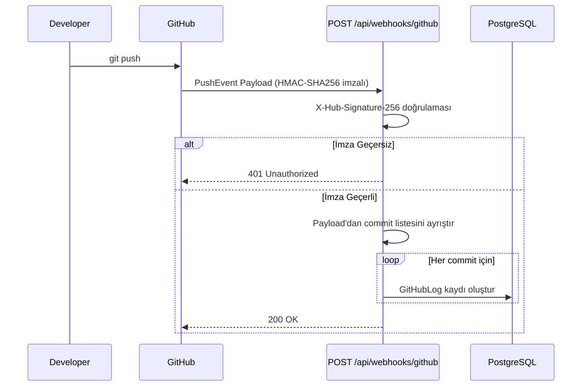

# 05. Entegrasyon ve API Spesifikasyonları - Dev4All

## 1. Giriş ve Amaç

Bu doküman, Dev4All platformunun dış sistemlerle kurduğu entegrasyonları teknik düzeyde tanımlar. MVP kapsamındaki iki kritik entegrasyon ele alınmaktadır:

1. **GitHub Webhook Entegrasyonu** — Proje geliştirme sürecinin commit aktiviteleri üzerinden şeffaf biçimde izlenmesi.
2. **E-posta Entegrasyonu (MailKit)** — Kullanıcıların kritik olaylarda bildirim alması.

> Entegrasyon mimarisine dair değişiklikler bu dokümanı güncellemeyi gerektirir. Her iki entegrasyonun implementasyonu **Infrastructure Katmanı**'nda yer alır; Application Katmanı yalnızca interface üzerinden iletişim kurar.

---

## 2. GitHub Entegrasyonu

### 2.1. Genel Bakış

Müşterinin "Geliştirici ne aşamada?" sorusuna cevap verebilmek için anlaşma sağlanan projelerle ilişkili GitHub aktiviteleri platforma aktarılır. Bu mekanizma iki aşamadan oluşur: **Repo Bağlantısı** ve **Webhook ile Aktivite Akışı.**

---

### 2.2. Aşama 1 — Repo Bağlantısı

**Tetikleyici:** Proje `Accept` edilerek `Ongoing` statüsüne geçer.

**Akış:**

```
Developer  ──►  Proje Detay Sayfası
               └─ "GitHub Repo Bağla" formu
                  ├─ RepoUrl   (zorunlu, github.com domain)
                  └─ Branch    (opsiyonel, varsayılan: "main")
                     │
                     ▼
               POST /api/projects/{id}/repo
                     │
                     ▼
               GitHubLog kaydı oluşturulur (ilk kayıt: repo bağlantı bilgisi)
                     │
                     ▼
               Customer'a "Repo Bağlandı" e-posta bildirimi
```

**Webhook Kurulumu (Developer Tarafı):**

Developer, GitHub reposunun `Settings > Webhooks > Add webhook` bölümüne şu bilgileri girer:

| Alan | Değer |
|------|-------|
| **Payload URL** | `https://api.dev4all.com/api/webhooks/github` |
| **Content Type** | `application/json` |
| **Secret** | Dev4All tarafından projeye atanan `WebhookSecretKey` |
| **Events** | Yalnızca `Push events` seçilir. |

---

### 2.3. Aşama 2 — Webhook ile Aktivite Akışı

**Tetikleyici:** Developer `git push` komutunu çalıştırır.

**Uçtan Uca Akış:**



**Webhook Endpoint Detayı:**

| Alan | Değer |
|------|-------|
| **Method** | `POST` |
| **Path** | `/api/webhooks/github` |
| **Authentication** | `HMAC-SHA256` imza doğrulaması (`X-Hub-Signature-256` header) |
| **Yetki** | Public endpoint; JWT gerekmez, imza ile korunur. |

**Gelen Payload'dan Ayrıştırılan Alanlar:**

```json
{
  "ref": "refs/heads/main",
  "repository": {
    "full_name": "developer/my-project",
    "html_url": "https://github.com/developer/my-project"
  },
  "commits": [
    {
      "id": "a1b2c3d4...",
      "message": "feat: login sayfası tamamlandı",
      "author": {
        "name": "Ali Yılmaz",
        "email": "ali@example.com"
      },
      "timestamp": "2025-04-10T14:22:00Z"
    }
  ]
}
```

**GitHubLog Kaydına Yazılan Alanlar:**

| Payload Alanı | GitHubLog Alanı |
|---------------|----------------|
| `commits[].id` | `CommitHash` |
| `commits[].message` | `CommitMessage` |
| `commits[].author.name` | `AuthorName` |
| `commits[].timestamp` | `PushedAt` |
| `repository.html_url` | `RepoUrl` |
| `ref` (branch adı ayrıştırılır) | `Branch` |

---

### 2.4. Güvenlik — HMAC-SHA256 Doğrulaması

Her gelen webhook isteği aşağıdaki adımlarla doğrulanır:

1. GitHub, request header'ına `X-Hub-Signature-256: sha256=<hash>` ekler.
2. API, `WebhookSecretKey` ile raw request body'yi `HMAC-SHA256` kullanarak yeniden hash'ler.
3. Hesaplanan hash, header'daki hash ile **timing-safe karşılaştırma** (`CryptographicOperations.FixedTimeEquals`) ile eşleştirilir.
4. Eşleşme yoksa `401 Unauthorized` döner; log kaydı oluşturulur.

---

### 2.5. Rate Limit Yönetimi

| Senaryo | Strateji |
|---------|----------|
| GitHub API rate limit yaklaşımı | Webhook tabanlı mimari sayesinde GitHub API aktif olarak sorgulanmaz; push geldiğinde veri yazılır. |
| Webhook teslim başarısızlığı | GitHub başarısız webhook'ları otomatik yeniden dener (3 deneme, 1/5/30 dk aralıkla). |
| Yoğun commit yükü | Tek bir `PushEvent`'te gelen tüm commit'ler döngüyle işlenir ve toplu `INSERT` ile veritabanına yazılır. |

---

## 3. E-Posta Entegrasyonu (MailKit)

### 3.1. Genel Bakış

Kullanıcılar arası iletişim kopukluğunu önlemek amacıyla platform, kritik iş olaylarında otomatik e-posta bildirimleri gönderir. Altyapı olarak `MailKit` kütüphanesi kullanılır ve tüm gönderimler **Quartz.NET** tabanlı bir arka plan kuyruğu üzerinden asenkron işlenir.

---

### 3.2. Bildirim Matrisi

| ID | Olay | Alıcı | Tetikleyici |
|----|------|-------|-------------|
| `MAIL-01` | Hoş Geldin & E-posta Doğrulama | Kayıt olan kullanıcı | Kayıt sonrası |
| `MAIL-02` | Yeni Teklif Bildirimi | Customer (İlan Sahibi) | Developer yeni Bid oluşturduğunda |
| `MAIL-03` | Teklif Kabul Edildi | Developer | Customer `AcceptBid` işlemi yaptığında |
| `MAIL-04` | Teklif Reddedildi | Developer | Başka bir teklif kabul edildiğinde (toplu) |
| `MAIL-05` | Proje Başladı / Repo Bağlandı | Customer | Developer GitHub repoyu bağladığında |

---

### 3.3. Asenkron Gönderim Mimarisi

E-posta gönderimi API yanıt süresini **etkilemez**. Akış şu şekilde işler:

```
İş Olayı Gerçekleşir
    │
    ▼
Application Handler
    │
    ▼
EmailQueue tablosuna kayıt ekle  ←── Senkron (hızlı DB yazımı)
    │
    ▼
API yanıt döner (200/201)

        [Arka Planda — Quartz.NET EmailDispatchJob]
        Her 1 dakikada bir:
            │
            ▼
        EmailQueue'daki Pending kayıtları sorgula
            │
            ▼
        MailKit ile SMTP üzerinden gönder
            │
        ┌───┴───────────────────┐
        ▼                       ▼
    Başarılı                Başarısız
    Status = Sent           RetryCount++
                            RetryCount < 3 → tekrar denenecek
                            RetryCount = 3 → Status = Failed, log yazılır
```

---

### 3.4. MailKit Yapılandırması

| Parametre | Açıklama | Kaynak |
|-----------|----------|--------|
| `SmtpHost` | SMTP sunucu adresi (örn. `smtp.gmail.com`) | `appsettings.json` |
| `SmtpPort` | Port numarası (örn. `587` — STARTTLS) | `appsettings.json` |
| `SenderEmail` | Gönderen adres (örn. `noreply@dev4all.com`) | `appsettings.json` |
| `SenderPassword` | SMTP kimlik bilgisi | **Environment Variable** (secret) |
| `UseSsl` | `true` / `false` | `appsettings.json` |

> `SenderPassword` hiçbir zaman `appsettings.json` veya kaynak koda yazılmaz. Üretim ortamında Azure Key Vault veya environment variable ile sağlanır.

---

### 3.5. E-posta Şablonları

Her bildirim tipi için HTML tabanlı şablon kullanılır. Şablonlar `Infrastructure/Templates/` klasöründe `.html` dosyası olarak tutulur ve değişkenler `{{PlaceholderName}}` söz dizimi ile yerleştirilir.

**Örnek — MAIL-03 (Teklif Kabul):**

```
Konu: Teklifiniz kabul edildi — {{ProjectTitle}}

Merhaba {{DeveloperName}},

"{{ProjectTitle}}" projesine verdiğiniz {{BidAmount}} TL'lik teklifiniz
müşteri tarafından kabul edildi.

Projeye erişmek için: {{ProjectUrl}}

Dev4All Ekibi
```

---

## 4. Bağlantılı Dokümanlar

| Doküman | Açıklama |
|---------|----------|
| `01-brd.md` | Business Requirements — Proje kapsamı ve iş hedefleri. |
| `02-frd.md` | Functional Requirements — GitHub ve e-posta kullanıcı hikayeleri. |
| `03-nfr.md` | Non-Functional Requirements — Webhook güvenliği ve e-posta kuyruğu gereksinimleri. |
| `04-sadm.md` | Sistem Mimarisi — Infrastructure Katmanı ve `GitHubLog` entity tanımı. |
